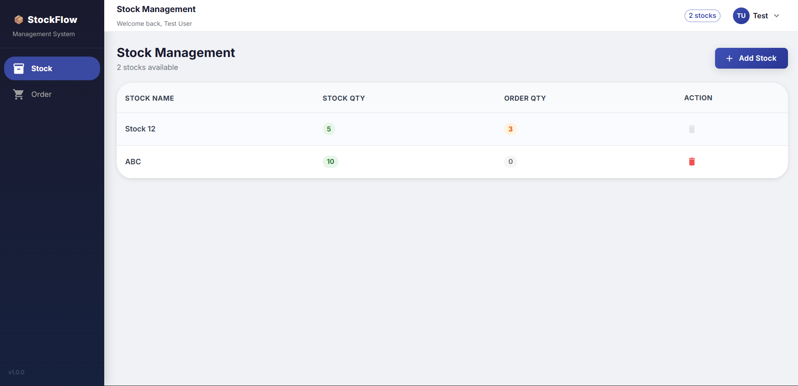
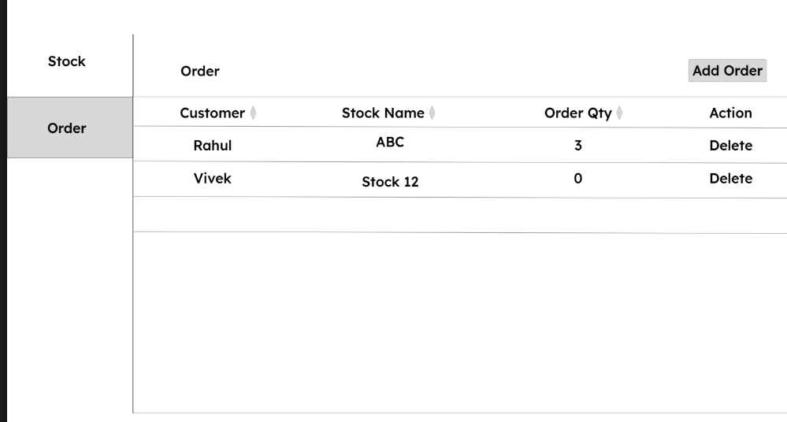
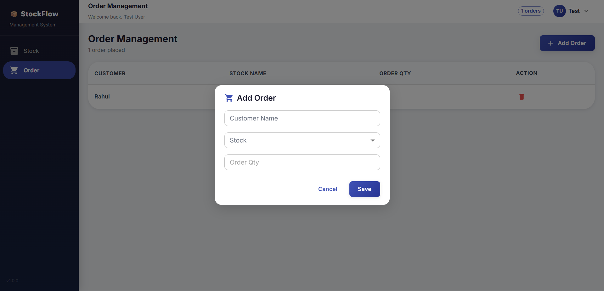

# StockFlow - Stock & Order Management System

A full-stack MERN (MongoDB, Express.js, React.js, Node.js) application built for robust stock and order management. This project strictly adheres to Object-Oriented Programming (OOP) principles and implements the Repository Pattern to ensure clean, maintainable, and scalable code.

## 📸 Application Screenshots

### Dashboard (Order Listing)


### Orders


### Add Stock Modal


### Add Order Modal


## 🚀 Application Features (As per PRD)

### Authentication (Login & Registration)
*   **Fully Functional Login/Registration:** Secure authentication system using JSON Web Tokens (JWT).
*   **Registration Fields:** First Name, Last Name, Password, Confirm Password.
*   **✨ Extra Feature Added - Email:** Added an `Email` field as the unique identifier for secure login. This was necessary as a robust alternative to logging in with just a "First Name" and is standard industry practice.
*   **Logout Functionality:** Invalidates the current Bearer token.
*   **Logout All Devices:** A dedicated option (found in the top-right user menu) to invalidate all active tokens for a user across every device they are logged in on.

### Stock Management (Dashboard)
*   **Stock List:** Displays all available stocks in a clean, Material Design table.
*   **Sorting:** Multi-column, client-side sorting capabilities applied to the list.
*   **Safe Deletion:** 
    *   Allows deleting a stock *only* if its Order Quantity is exactly `0`.
    *   Prevents deletion (button visually disabled) if the stock is actively tied to any orders.
*   **Add Stock Modal:**
    *   **Name:** Required validation and restricts duplicate stock names in the database.
    *   **Quantity:** Required validation. Negative and zero values are strictly blocked.

### Order Management (Dashboard)
*   **Order List:** Displays all customer orders.
*   **Sorting:** Multi-column sorting applied to the order list.
*   **Stock Synchronization Operations:**
    *   **Adding an Order:** Automatically increments the `orderQty` on the stock, reducing its effective availability.
    *   **Deleting an Order:** Reverts/deducts the `orderQty` from the corresponding stock.
*   **Add Order Modal:**
    *   **Customer Name:** Required validation.
    *   **Stock Selection:** Dynamic dropdown displaying available stock names alongside their *currently available* quantity.
    *   **Quantity Validation:** Blocks negative/zero values. Crucially, ensures the order quantity *never exceeds* the currently available stock quantity for the selected item.

## 🛠️ Architecture & Tech Stack

**Tech Stack:**
*   **Frontend:** React (Vite), Material UI (MUI v5)
*   **Backend:** Node.js, Express.js
*   **Database:** MongoDB Atlas, Mongoose
*   **API Communication:** Axios

**Design Patterns Used:**
1.  **Repository Pattern:** Separates the data access logic (database queries) from the business logic. 
    *   *Path:* `backend/src/repositories/`
2.  **Service Layer:** Contains the core business logic and validations.
    *   *Path:* `backend/src/services/`
3.  **Controller Layer:** Handles HTTP request/responses and delegates tasks to the Service Layer.
    *   *Path:* `backend/src/controllers/`
4.  **OOP Concepts:** Classes, Inheritance (BaseRepositories), Encapsulation, and virtual computing properties are heavily utilized across models, repositories, and services.

## ⚙️ Installation & Setup

Ensure you have Node.js and npm installed.

### 1. Backend Setup
```bash
cd backend
npm install
npm run dev
```
*Backend runs on http://localhost:5000*

### 2. Frontend Setup
Open a new terminal window:
```bash
cd frontend
npm install
npm run dev
```
*Frontend runs on http://localhost:5173*
